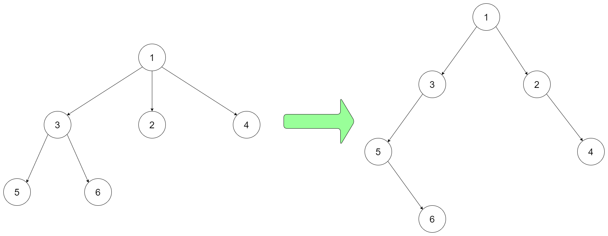
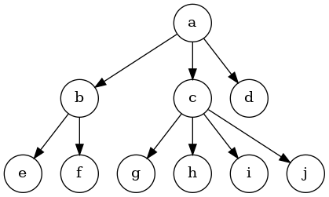
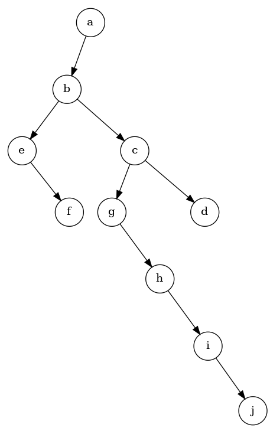

# 二叉树
二叉树是经典的数据结构，拥有一个Value和左右两个子树。

## 二叉树的遍历
二叉树的遍历一般分为**先序遍历**，**中序遍历**和**后序遍历**3种。
1. 先序遍历：先打印根节点，再打印左子树，最后打印右子树。
2. 中序遍历：先打印左子树，再打印根节点，最后打印右子树。
3. 后序遍历：先打印左子树，再打印右子树，最后打印根节点。

这3种遍历其实都是人为规定的，总共的遍历方式其实有6种，比如先打印右子树，再打印左子树，最后打印根节点，这种算什么遍历呢？

另外，二叉树的遍历还有按层遍历，即按照每层依次从左往右打印，比如
```
      1      
    /   \    
  2       3  
 / \     / \ 
4   5   6   7
遍历就是：1 2 3 4 5 6 7
```

### 递归方式遍历二叉树
#### 1.先序遍历
```go
// Pre 先序遍历
func (r *RecursiveTraversalBT) Pre(root *Node) {
	if root == nil {
		return
	}
	// 先打印根节点
	fmt.Printf("%d ", root.Value)
	// 再打印左子树
	r.Pre(root.Left)
	// 再打印右子树
	r.Pre(root.Right)
}
```

#### 2.中序遍历
```go
// In 中序遍历
func (r *RecursiveTraversalBT) In(root *Node) {
	if root == nil {
		return
	}
	// 先打印左子树
	r.In(root.Left)
	// 再打印自己
	fmt.Printf("%d ", root.Value)
	// 最后打印右子树
	r.In(root.Right)
}
```

#### 3.后序遍历
```go
// Pos 后序遍历
func (r *RecursiveTraversalBT) Pos(root *Node) {
	if root == nil {
		return
	}
	// 先打印左子树
	r.Pos(root.Left)
	// 再打印右子树
	r.Pos(root.Right)
	// 最后打印自己
	fmt.Printf("%d ", root.Value)
}
```

### 递归序
递归序指的是，在遍历过程中，每个节点都会到达3次，第1次是遍历到当前节点，第2次是遍历完左子树，回到当前节点，第3次是遍历完又子树，回到当前节点。
```go
func f(root *Node) {
	if root == nil {
		return
	}
	fmt.Println("第一次到达")
	// 遍历左子树
	f(root.Left)
	fmt.Println("第二次到达")
	// 遍历右子树
	f(root.Right)
	fmt.Println("第三次到达")
}
```
先序遍历的本质就是**第1次到达当前节点时打印**。<br>
中序遍历的本质就是**第2次到达当前节点时打印**。<br>
后序遍历的本质就是**第3次到达当前节点时打印**。


### 使用非递归的方式遍历二叉树

#### 1.先序遍历
准备一个栈，然后流程如下
1. 将根节点入栈，栈不空就一直遍历
2. 弹出栈顶元素并给cur，弹出就打印。
3. 如果有右子树，右子树入栈，如果有左子树，左子树入栈(先入左再入右)
4. 不断重复2和3步骤，直到栈弹空。

理解：对于每一颗子树来说，都是先根节点入栈，再弹出，然后右子树入栈再左子树入栈。所以弹出时是
先弹出根，再左再右，每颗子树都是如此，所以整体的顺序就是先序遍历的顺序。


代码如下：
```go
// Pre 先序遍历
func (r *UnRecursiveTraversalBT) Pre(root *Node) {
	if root == nil {
		return
	}
	// 创建一个栈，并先把根节点压入
	stack := class_03.NewMyStack[*Node]()
	stack.Push(root)
	for !stack.IsEmpty() {
		cur := stack.Pop()
		// 出栈就打印
		fmt.Printf("%d ", cur.Value)
		// 有右子树，就入栈
		if cur.Right != nil {
			stack.Push(cur.Right)
		}
		// 有左子树，就入栈
		if cur.Left != nil {
			stack.Push(cur.Left)
		}
	}
	fmt.Println()
}
```

#### 2.后续遍历
从先序遍历的流程，我们用栈实现了先头再左再右的先序遍历顺序打印，用的方式是头入栈之后出栈，然后将头的右左子树分别入栈。

那么我们也可以实现先头再右再左的打印，方式是弹出头后，先入栈左子树，再入栈右子树。

进一步，上面的流程是**一出栈就打印**，如果我们在上面的基础上改动，一出栈就不打印，而是压入另一个栈。整个事情做完之后，再将另一个栈依次打印。

那么，最后打印的顺序是 头右左 的逆序，也就是 左右头，也就实现了后序遍历。

代码如下：
```go
// Pos1 后序遍历
func (r *UnRecursiveTraversalBT) Pos1(root *Node) {
	if root == nil {
		return
	}
	s1 := class_03.NewMyStack[*Node]()
	s2 := class_03.NewMyStack[*Node]()
	s1.Push(root)
	for !s1.IsEmpty() {
		head := s1.Pop()
		// 只要出栈，不打印，而是压入另一个栈
		s2.Push(head)
		// 弹出后依次压入左和右，实现整体 头 右 左 的顺序弹出
		if head.Left != nil {
			s1.Push(head.Left)
		}
		if head.Right != nil {
			s1.Push(head.Right)
		}
	}
	// 所有事情做完，依次将s2弹出
	for !s2.IsEmpty() {
		fmt.Printf("%d ", s2.Pop().Value)
	}
}
```

#### 4. 怎么只使用一个栈，实现后序遍历
这个流程很难，基本上面试官也没有多少会的，左神在课上没讲，只给了代码，可以掌握也可以不掌握。代码如下：
```java
	public static void pos2(Node h) {
		System.out.print("pos-order: ");
		if (h != null) {
			Stack<Node> stack = new Stack<Node>();
			stack.push(h);
			Node c = null;
			while (!stack.isEmpty()) {
				c = stack.peek();
				if (c.left != null && h != c.left && h != c.right) {
					stack.push(c.left);
				} else if (c.right != null && h != c.right) {
					stack.push(c.right);
				} else {
					System.out.print(stack.pop().value + " ");
					h = c;
				}
			}
		}
		System.out.println();
	}
```

#### 5.中序遍历
中序遍历是先左子树，然后头节点，最后右子树。对于不管多高的二叉树，**最先遍历到的，一定是左边界的最后一个节点**，然后是头节点和右子树。<br>
所以中序遍历的本质是，**将整颗树按照左边界做了一个拆分**。

中序遍历的流程如下：

准备一个栈和一个cur变量，初始时cur指向根节点，循环条件是**栈不为空或者cur不为空**（栈为空且cur为空，就退出）
1. 如果cur不为空，cur入栈，cur跳到cur的左子树。
2. 如果cur为空，则**栈弹出一个节点给cur接收，同时打印，同时cur指向cur的右子树**。
3. 重复上述过程，直到cur为空且栈也弹空了，退出。

具体实例：
```
我们以这颗树为例：
      1      
    /   \    
  2       3  
 / \     / \ 
4   5   6   7
1. 初始cur不断往左边界走，直到走到4，一直入栈，stack = 1 2 4  栈顶是4，此时cur走到4的左孩子，是空
2. 弹出4打印，栈是 1 2，cur指向4的右孩子，cur又是空
3. 弹出2打印，栈是 1，cur指向2的右孩子为5，不为空，5入栈，栈是 1 5，cur来到5的左孩子，是空
4. 弹出5打印，栈是 1，cur指向5的右孩子为空
5. 弹出1打印，栈是空，cur指向1的右孩子，是3
6. 3入栈，栈是3，cur指向3的左孩子6
7. 6入栈，栈是3 6，cur指向6的左孩子，为空
8. 弹出6打印，栈是3，cur指向6的右孩子为空
9. 弹出3打印，栈为空，cur指向3的右孩子7
10.7入栈，栈是7，cur指向7的左孩子，是空
11.弹出7打印，cur指向7的右孩子，是空，此时栈是空，cur也是空，循环退出。
至此，依次打印了 4 2 5 1 6 3 7
```
代码如下：
```go
// In 中序遍历
func (r *UnRecursiveTraversalBT) In(root *Node) {
	if root == nil {
		return
	}
	// 创建一个栈，如果当前节点有左孩子，就压入，并不断往左边界靠
	stack := class_03.NewMyStack[*Node]()
	cur := root
	for !stack.IsEmpty() || cur != nil {
		if cur != nil {
			stack.Push(cur)
			cur = cur.Left
		} else {
			cur = stack.Pop()
			fmt.Printf("%d ", cur.Value)
			cur = cur.Right
		}
	}
	fmt.Println()
}
```

#### 6.实现按层遍历
如果将二叉树理解为图，则按层遍历是宽度优先搜索，用队列实现。

准备一个队列，并先将根节点放队列里。
1. 从队列里弹出一个节点，打印，并给cur
2. cur如果有左孩子，左孩子入队列，如果有右孩子，右孩子入队列
3. 循环1 2步骤，直到队列为空。

举例：
```
我们以这颗树为例：
      1      
    /   \    
  2       3  
 / \     / \ 
4   5   6   7
1. 1入队列
2. 1弹出，打印，1给cur，cur的左右子树入队列[2,3]
3. 2弹出，打印，2给cur，cur的左右子树入队列[3,4,5]
4. 3弹出，打印，3个cur，cur的左右子树入队列[4,5,6,7]
5. 4弹出，打印，无左右子树，不入队列
6. 5弹出，打印，无左右子树，不入队列
7. 6弹出，打印，无左右子树，不入队列
8. 7弹出，打印，入左右子树，不入队列

综上，整体打印顺序是 1 2 3 4 5 6 7 按照层遍历。
```
总结：这个流程是按照层遍历的，但是我们不知道遍历时每一层的开始和结束。有些算法题需要直到，比如求最大的层宽度。


## 二叉树的序列化和反序列化
给一个内存中的二叉树，能将这个二叉树用某种规则转换成一个唯一的字符串，并且可以根据这个字符串反转成当前唯一的二叉树。这就是序列化和反序列化。

常规的方式是按**先序遍历方式序列化**和按**层遍历方式序列化**。

比如：先序遍历中，遇到nil不忽略，用#表示，遇到正常节点，拼接值，并所有都用`,`隔开。
```
               1      
        /              \    
        2               3  
     /    \           /     \ 
    4       5        6       7
   /\      / \      / \     / \
 nil nil nil nil   nil nil nil nil
 
先序方式序列化就是： "1,2,4,#,#,5,#,#,3,6,#,#,7,#,#"

反序列化时，也是按照先序的方式重新建树
```

二叉树可以通过先序、后序或者按层遍历的方式序列化和反序列化。
但是，二叉树无法通过中序遍历的方式实现序列化和反序列化
因为不同的两棵树，可能得到同样的中序序列，即便补了空位置也可能一样。
比如如下两棵树
```
        __2
       /
      1
      
      和
      1__
         \
          2
```
补足空位置的中序遍历结果都是{ null, 1, null, 2, null} （#,1,#,2,#）

### 关于空树
序列化成字符串，如果序列化后的值是"#"，不管是先序、后序还是按层遍历的方式，都表示只有一个节点，且为空（即空树）。而空字符串，也能表示空树。
为了避免歧义，我们这里规定序列化空树，一定序列化成"#"。反序列化时，如果出现了空字符串和"#"，则都反序列化为空树。


### 代码实现
[code04_serialize_and_reconstruct_tree.go](code04_serialize_and_reconstruct_tree.go)

## 算法面试题：将N叉树转码为二叉树
Encode N-ary Tree to Binary Tree

leetCode原题链接：https://leetcode.cn/problems/encode-n-ary-tree-to-binary-tree/

设计一个算法，可以将 N 叉树编码为二叉树，并能将该二叉树解码为原 N 叉树。一个 N 叉树是指每个节点都有不超过 N 个孩子节点的有根树。类似地，一个二叉树是指每个节点都有不超过 2 个孩子节点的有根树。你的编码 / 解码的算法的实现没有限制，你只需要保证一个 N 叉树可以编码为二叉树且该二叉树可以解码回原始 N 叉树即可。

这个二叉树可以认为是这颗多叉树的序列化结果，能够重新转换回原来的多叉树。

例如，你可以将下面的 3-叉 树以该种方式编码：


注意，上面的方法仅仅是一个例子，可能可行也可能不可行。你没有必要遵循这种形式转化，你可以自己创造和实现不同的方法。

### 解题思路
思路可以概括为一句话：假如`x`是多叉树任意一个节点，那么则让`x`的所有孩子，都在二叉树中`x`的左孩子的右边界上。
举例如下：

比如一颗N叉树如下：



上述思路转换后的二叉树如下：


我们可以看到，a的孩子，全部挂在了a左子树的右边界 b->c->d

b的孩子，也挂在了b左孩子的右边界 e->f

c的孩子，全部挂在了c的左孩子的右边界 g->h->i->j

### 代码详解
[code05_encode_nary_tree_to_binary_tree.go](code05_encode_nary_tree_to_binary_tree.go)

## 算法面试题：给定一颗二叉树，返回最大的宽度
比如：
```
             1
            / \
           2   3
               / \
              4   5
              /
              6
               \
                7
第2 3层的宽度都是2，则返回2。
显然不是层数越高宽度越高。
```

### 思路
我们已经实现了按层遍历，如果我们能在遍历时，记住当前层开始和结束的位置，则能统计每一层的宽度。（这里假设您已经对按层遍历的流程比较熟悉，如不熟悉的，请参考前面的按层遍历代码。）我们只需要通过有限几个变量，就能做到，这几个变量的定义如下：
1. max : 统计全局最大的宽度，当计算到某一层宽度比max大时，更新max，最终返回max。
2. curEnd(*TreeNode类型)：记录遍历的当前层的结束节点。
3. nextEnd(*TreeNode类型)：记录即将遍历的下一层的结束节点，为下一层遍历做准备。
4. count: 当前层宽度统计，每当发现当前层从队列中弹出一个节点，则count++。

具体流程举例如下：<br>
我们假设一颗树的结构如下：
```
                1
              /   \
             2     3
            / \     \
           4   5     6 
               /      \
              7        8
```
流程执行的过程如下：
```
max=0; curEnd=nil; nextEnd=nil; count=0;
1. 遍历到1,1入队列，curEnd = 1; queue = [1];

2. 1出队列，count++; 
   1左孩子2入队列，nextEnd=2; 
   1右孩子3入队列，nextEnd=3; 
   由于1==curEnd，当前行结束，max更新为1，同时curEnd=nextEnd,nextEnd=nil, count清零; 
   最终：queue=[3,2]; count=0; max=1; curEnd=3; nextEnd=nil

3. 2出队列，count++，count=1;
   2左孩子4入队列，nextEnd=4;
   2右孩子5入队列，nextEnd=5;
   最终：queue=[5,4,3]; count=1; max=1; curEnd=3; nextEnd=5;

4. 3出队列，count++,count=2;
   3没有左孩子，不如队列
   3右孩子入队列，nextEnd=6;
   由于3==curEnd，当前行结束，max更新为2，同时curEnd=nextEnd,nextEnd=nil, count清零
   最终：queue=[6,5,4]；count=0; max=2; curEnd=6; nextEnd=nil;

5. 4出队列，count++，count=1，4没有孩子，不入队列。

6. 5出队列，count++，count=2；
   5的左孩子7入队列，nextEnd=7;
   最终：queue=[7,6]; count=2; max=2; curEnd=6; nextEnd=7;

7. 6出队列，count++，count=3；
   6的右孩子8入队列，nextEnd=8;
   由于6==curEnd，当前行结束，max更新为3，同时curEnd=nextEnd,nextEnd=nil, count清零
   最终：queue=[8,7]; count=0; max=3; curEnd=8; nextEnd=nil;
   
8. 7出队列，count++,count=1;
   7没有孩子，不入队列，7也不等于curEnd，当前行继续;
   
9. 8出队列，count++,count=2;
   8没有孩子，不入队列；
   由于8==curEnd，当前行结束，max=3比2大不更新，同时curEnd=nextEnd,nextEnd=nil, count清零。
   最终：queue=[]; count=2; max=3; curEnd=nil; nextEnd=nil;
   此时队列为空，整个遍历流程结束，返回最大值3。

```
总结：每次遍历到一个节点（指这个节点出队列）时，提前准备下一层的最后一个节点，并不断往右推，当前层结束时，nextEnd一定正好推到了下一层的最后一个节点。
同时通过curNext能知道是否当前层结束了。

### 代码实现

[code05_tree_max_width.go](code05_tree_max_width.go)

## 面试题：给定一个有父指针的二叉树的某个节点，返回该节点的**后继节点**
二叉树的节点结构如下：
```go
type TreeNodeP struct {
	Val int
	Parent *TreeNodeP
	Left *TreeNodeP
	Right *TreeNodeP
}
```
给定这颗二叉树的一个节点，返回这个二叉树的后继节点，如果没有，则返回nil。

### 后继节点
后继节点是一颗二叉树按照中序遍历顺序排列后，节点的后面一个节点。比如一颗二叉树如下：
```
                  a
               /     \
              b       c
             / \     / \
            d   e   f   g
                   / \
                  h   i
                       \
                        j
```
按照中序遍历，则为`dbeahfijcg`，那么`b`的后继节点为`e`，`c`的后继节点为`g`。

### 思路
正常来讲，如果要找二叉树的某个节点的后继节点，需要给定头节点和要找的节点X，先根据头节点生成中序遍历的顺序，然后再找X在中序遍历中的下一个。
这个过程的时间复杂度是O(N)(N是节点个数)。

现在X节点能找到父节点，此时可以只给你X节点，不给你头节点，也能实现。因为X可以一直往上找，直到找到根节点，就又可以生成中序遍历。

但是这种方式仍然是O(N)的复杂度，有没有一种方式，能实现O(K)的复杂度呢？（K是当前节点与下一个节点的距离。）比如上面例子中的`e`节点的后继是根节点`a`,`e` 与 `a`的距离只有2。而遍历整颗树的规模是10。

答案是有的，流程如下：
1. 如果X有右孩子，则X的后继是X右孩子的最左节点。比如上面的a，后继是右子树的最左节点h。
2. 如果X没有右孩子，则X一直沿着父指针往上找，如果是父亲的右子树，则继续，直到是它父亲的左孩子，则这个父亲是当前X的后继。<br>
   比如上面的j节点，找到父亲i，j是i的右孩子，继续；找到i的父亲f，i是f的右孩子，继续；找到f的父亲c，f是c的左孩子，停，则c是i的后继。
3. 如果2过程一直找到空了，都没找到哪个节点是它父亲的左孩子，**则说明这个节点是整棵树的最右节点，没有后继**。

这个流程的时间复杂度是O(K)

### 代码实现
[code06_successor_node.go](code06_successor_node.go)