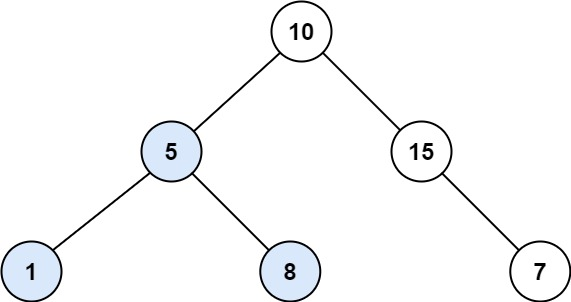

# 13课：二叉树相关算法题以及二叉树的递归套路


## 面试题1：判断一棵二叉树是否是完全二叉树
给定一棵二叉树的根节点，判断是否是完全二叉树。是就返回true,不是就返回false。

### 完全二叉树
之前在堆的章节讲过，堆结构就是一个完全二叉树。完全二叉树的定义： 

一棵二叉树如果前面每层都是满的，最后一层就算不满，也是在从左往右依次变满的路上。则是完全二叉树。

### 思路
将二叉树按层遍历，遍历到了节点X：
1. 如果X节点有右孩子没有左孩子，则一定不是完全二叉树，直接返回false。
2. 当第一次遇到左右孩子不双全的时候，剩下的节点必定全是叶子节点，如果遇到一个不是，则返回false。
3. 2步骤如果一直满足，直到遍历完了，则是完全二叉树，返回true。

### 代码

[code01_is_cbt.go](code01_is_cbt.go)

## 二叉树的递归套路

### 题目1：给定一个二叉树头节点，返回是否是平衡二叉树

#### 平衡二叉树概念
一个二叉树的**每个子树**，左树高度和右树高度差的绝对值不大于1（<=1），则这颗树是平衡二叉树。

举例说明：
``` 
例子1：
                       1
                      / \
                     2   3
                    / \
                   4   5
4 2 5 1 3
1：左右高度差1，满足 2：左右高度相等 3 4 5：左右高度相等，整棵树是平衡二叉树

例子2：                 
                       1
                      / \
                     2   3
                    / \
                   4   5
                      /
                     6
对于 2 3 4 5 6 来说，都是平衡二叉树，但是1的左孩子高度3，右孩子高度1，高度差>1，则这整颗树不是平衡二叉树。


例子3：                   
                       1
                      / \
                     2   3
                    /     \
                   4       5
                  /         \
                 6           7
虽然1的左右高度都是3，但是对于2来说，左子树高度2，右子树高度0，高度差>1，所以整棵树不是平衡二叉树（3同理）。
```

#### 解题思路
假设我们得到了一个节点X，X可以是整颗二叉树的任意子树头节点。判断X是平衡二叉树，需要有以下几个条件：
1. X的左子树是平衡二叉树
2. X的右子树是平衡二叉树
3. X的左子树高度 - X右子树高度的绝对值 < 2

那么我们设计递归时，需要递归函数返回两个信息：
1. 你是否是平衡二叉树
2. 你的高度

那么递归函数的伪代码如下
```go
// 递归过程伪代码
func process(x *TreeNode) (isBalanced bool, height int){
    // 左子树是否平衡以及高度
	lb,lh := process(x.Left)
    // 右子树是否平衡以及高度
	rb,rh := process(x.Right)
	// 我的高度，是左右子树高度最大值+1
    height = max(lh, rh)
	// 我是否平衡，取决于左右平衡且高度差绝对值<2
	isBalanced = lb && rb && |lh - rh| < 2
	return isBananced, height
}
```

#### 代码完整实现
```go
package class_13

import "ZuoShenAlgorithmGo/utils"

type TreeNode struct {
	Val   int
	Left  *TreeNode
	Right *TreeNode
}
// 判断一棵二叉树是否是平衡二叉树

func IsBalanced(root *TreeNode) bool {
	if root == nil {
		return true
	}
	// 主函数只需要获取平衡，不获取高度
	isBalanced, _ := processIsBalanced(root)
	return isBalanced
}

// 递归函数，返回一个节点是否是平衡二叉树，以及高度
func processIsBalanced(x *TreeNode) (isBalanced bool, height int) {
	// 如果是空树，则高度是0，且是平衡二叉树
	if x == nil {
		isBalanced, height = true, 0
		return
	}
	// 不是空树，分别递归获取左右的高度以及是否平衡
	leftIsB, leftH := processIsBalanced(x.Left)
	rightIsB, rightH := processIsBalanced(x.Right)

	// 平衡条件：左右子树都平衡，且左右子树高度差绝对值小于2
	isBalanced = leftIsB && rightIsB && getDelAbs(leftH, rightH) < 2
	// 当前树的高度，左右子树中高度最大的+1
	height = utils.Max(leftH, rightH) + 1
	return
}

// 求相减后的绝对值
func getDelAbs(a, b int) int {
	del := a - b
	if del < 0 {
		del = -del
	}
	return del
}
```

#### 解题思路2
我们先假定这颗树是一个平衡二叉树，那么左右孩子都是平衡二叉树，且左右孩子的高度差不

### 题目2:给定一颗二叉树，判断是否是搜索二叉树

#### 搜索二叉树
每一颗子树，左子树都比头节点小，右子树都比头结点大，则这颗树是搜索二叉树。

**举例**
```
                         5
                      /     \
                     3       7
                    / \     / \
                   2   4   6   8
5:左边324都比5小，右边 768都比5大，满足
3：左边2右边4，满足
7：左边6右边8，满足
叶子节点不讨论，没有左右子树，满足

整颗二叉树是搜索二叉树。
```

#### 搜索二叉树性质
由定义可知：
1. 一颗搜索二叉树，不可能有重复值（假设x是任意子树的头，左边全部比x小，不可能与x相等，右边全部比x大，也不可能与x相等，则整棵树只能有1个x，x的父亲），则整颗树不可能有重复值。
2. 一颗搜索二叉树，如果中序遍历，则遍历的结果一定是升序排序的。

#### 解题思路
同样假设我们得到了一个节点X，X可以是整颗二叉树的任意子树头节点。判断X是搜索二叉树，需要有以下几个条件：
1. X的左树得是搜索二叉树
2. X的右树得是搜索二叉树
3. 拿到X左树的最大值max，X > max
4. 拿到X右树的最小值min，X < min

如果满足这4个条件，则X是搜索二叉树。这样我们同样可以设计一个递归，递归函数返回每个子树是否是搜索二叉树，以及最小值和最大值。
伪代码如下：
```go
// 主函数调用
func IsBST(root *TreeNode) bool {
    isBst,_,_ :=  processIsBST(root)
    return isBst
}

func processIsBST(x *TreeNode)(isBst bool, max, min int) {
    leftIsBst, leftMax, leftMin := processIsBST(x.Left)
    rightIsBst, rightMax, rightMin := processIsBST(x.Right)
    // x是搜索二叉树条件
    isBst = leftIsBst && rightIsBst && x.Val > leftMax && x.Val < rightMin
    // x整棵树的最小值，左右最小值与x.Val的最小值
    min = getMin(leftMin, x.Val, rightMin)
    // x整棵树的最大值，左右最大值与x.Val的最大值
    max = getMax(leftMax, x.Val, rightMax)
    return isBst, max, min
}
```

#### 代码实现

[code03_is_bst.go](code03_is_bst.go)

#### 解题思路2
由搜索二叉树的性质可知，搜索二叉树中序遍历一定是升序。这是个充分必要条件，如果是搜索二叉树，则中序遍历一定是升序，如果中序遍历后是升序，则一定是搜索二叉树。

所以可以先将二叉树按照中序遍历获取到顺序，再判断是否是升序，则可以判断是否是搜索二叉树。

#### 代码实现
```go
// IsBST2 通过中序遍历是否升序的方式判断是否是搜索二叉树
func IsBST2(root *TreeNode) bool {
	if root == nil {
		return true
	}
	inList := make([]int, 0)
	// 中序遍历
	in(root, &inList)
	// 判断inList是否是升序，如果不是，则不是搜索二叉树
	for i := 1; i < len(inList); i++ {
		if inList[i] <= inList[i-1] {
			return false
		}
	}
	return true
}

// 递归实现中序遍历，并将顺序记录到list中
func in(x *TreeNode, list *[]int) {
	if x == nil {
		return
	}
	in(x.Left, list)
	*list = append(*list, x.Val)
	in(x.Right, list)
}
```

### 题目3:给定一颗二叉树，判断是否是满二叉树
满二叉树指的是每层的节点都是满的，即每层的节点个数是2的(当前层数-1)次方。
```
      5          2的0次方 1
   /     \    
  3       7      2的1次方 2
 / \     / \
2   4   6   8    2的2次方 4

```
满二叉树的总节点个数n，与层数l的关系是 `n = 2^l - 1`：
```
l  n
1  1  = 2^1-1
2  3  = 2^2-1
3  7  = 2^3-1
4  15 = 2^4-1
5  31 = 2^5-1
```

#### 解题思路
在每次递归时，获取到子树的高度和节点个数，则能判断子树是否是满二叉树，同时也能计算出当前树的高度和节点个数，也能判断当前树是否是满二叉树。

#### 代码实现

[code04_is_full.go](code04_is_full.go)

### LeetCode第333题：最大的BST子树
LeetCode链接：https://leetcode.cn/problems/largest-bst-subtree/

给定一个二叉树，找到其中最大的二叉搜索树（BST）子树，并返回该子树的大小。其中，最大指的是子树节点数最多的。

**二叉搜索树（BST）** 中的所有节点都具备以下属性：

- 左子树的值小于其父（根）节点的值。
- 右子树的值大于其父（根）节点的值。

注意：子树必须包含其所有后代。

**示例1：**


> 输入：root = [10,5,15,1,8,null,7] <br>
输出：3 <br>
解释：本例中最大的 BST 子树是高亮显示的子树。返回值是子树的大小，即 3 。

#### 解题思路
每次递归过程，需要知道左子树和右子树的以下信息，就能获取到最大的BST子树。
1. 子树是否是二叉搜索树（BST）
2. 子树最大二叉搜索子树的大小
3. 子树的最大节点
4. 子树的最小节点
5. 子树的节点个数

递归过程：
1. 如果任意一个子树不是二叉搜索树（BST），则当前也不是
2. 当前的节点个数=左子树节点数（如果有）+右子树节点数（如果有）+1
3. 当前的最大子BST节点数：<br>
    3.1 如果当前就是二叉搜索树，则最大子BST节点数就是当前节点个数<br>
    3.2 如果当前不是二叉搜索树，则最大子BST节点数是左右子树中较大者

#### 代码实现
```go
package class_13

import "ZuoShenAlgorithmGo/utils"

func largestBSTSubtree(root *TreeNode) int {
	if root == nil {
		return 0
	}
	return largestBstProcess(root).largestBstN
}

func largestBstProcess(x *TreeNode) *largestBstInfo {
	if x == nil {
		return nil
	}
	leftInfo := largestBstProcess(x.Left)
	rightInfo := largestBstProcess(x.Right)
	max := x.Val
	if leftInfo != nil {
		max = utils.Max(leftInfo.max, max)
	}
	if rightInfo != nil {
		max = utils.Max(rightInfo.max, max)
	}
	min := x.Val
	if leftInfo != nil {
		min = utils.Min(leftInfo.min, min)
	}
	if rightInfo != nil {
		min = utils.Min(rightInfo.min, min)
	}
	isBst := true // 先默认是搜索二叉树
	// 左子树不为空且左子树不是搜索二叉树，则不是
	if leftInfo != nil && !leftInfo.isBst {
		isBst = false
	}
	// 右子树不为空且右子树不是搜索二叉树，则不是
	if rightInfo != nil && !rightInfo.isBst {
		isBst = false
	}
	// 左子树的最大值不比当前值小，则不是
	if leftInfo != nil && leftInfo.max >= x.Val {
		isBst = false
	}
	// 又子树的最小值不比当前值大，则不是
	if rightInfo != nil && rightInfo.min <= x.Val {
		isBst = false
	}
	n := 1
	if leftInfo != nil {
		n += leftInfo.n
	}
	if rightInfo != nil {
		n += rightInfo.n
	}
	var largestBstN int
	// 如果当前子树就是BST，则最大的BST节点个数就是当前子树的节点个数
	if isBst {
		largestBstN = n
	} else {
		// 如果当前子树不是BST，则最大的BST节点个数是左右子树中的较大者
		if leftInfo != nil {
			largestBstN = getMax(largestBstN, leftInfo.largestBstN)
		}
		if rightInfo != nil {
			largestBstN = getMax(largestBstN, rightInfo.largestBstN)
		}
	}

	return &largestBstInfo{
		isBst:       isBst,
		max:         max,
		min:         min,
		largestBstN: largestBstN,
		n:           n,
	}
}

type largestBstInfo struct {
	isBst       bool
	max         int
	min         int
	largestBstN int // 子树的最大BST节点个数
	n           int // 子树本身的节点个数
}

func getMax(a, b int) int {
	if a > b {
		return a
	}
	return b
}

```